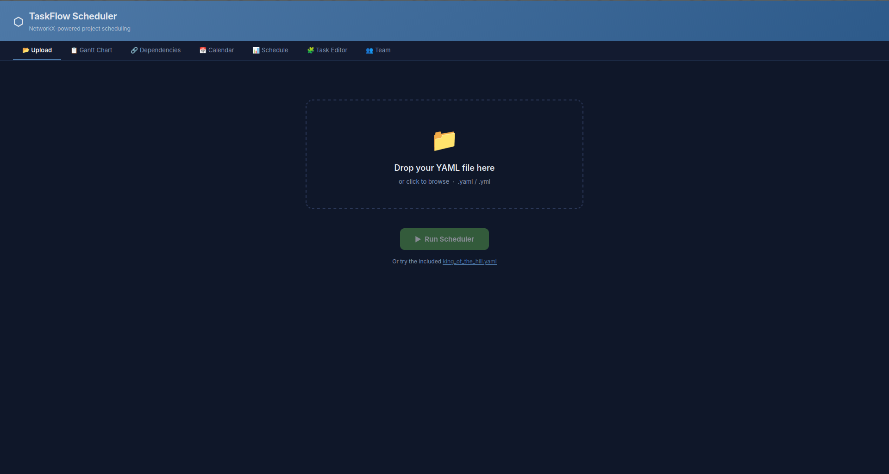
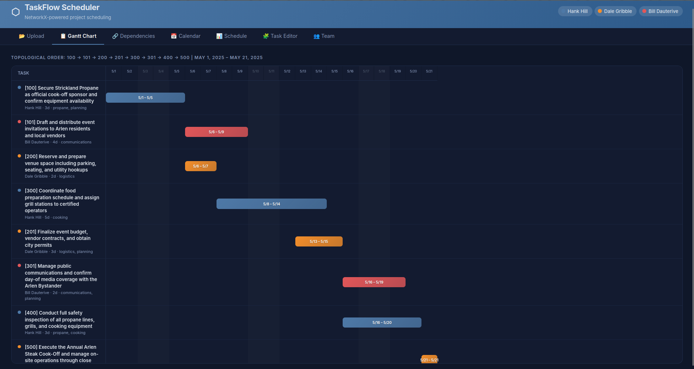
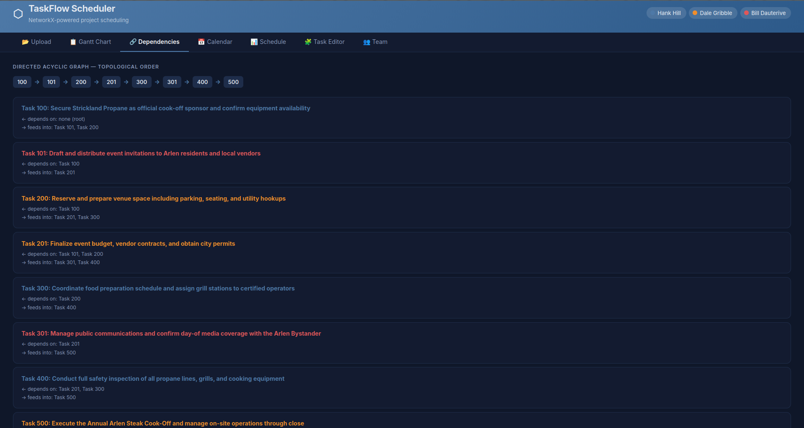
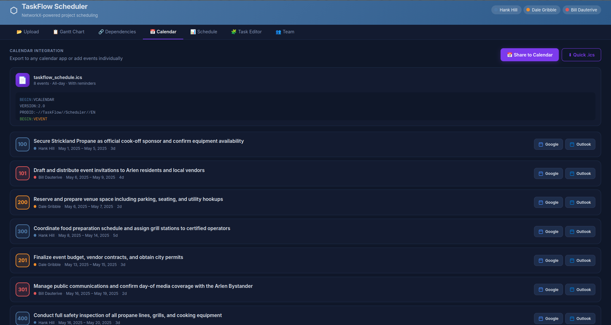
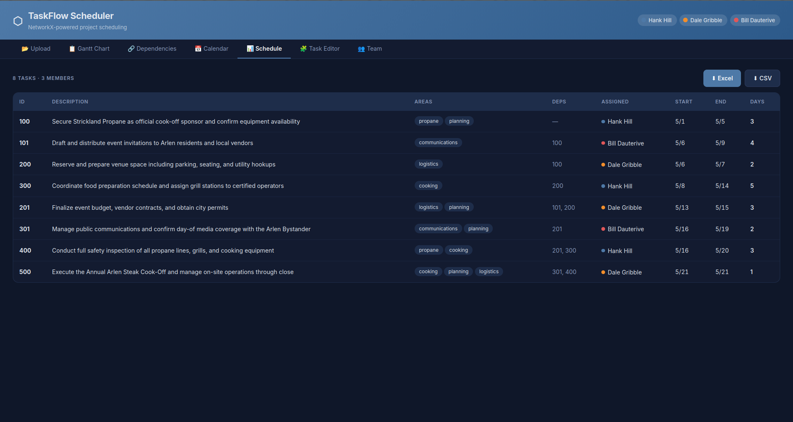
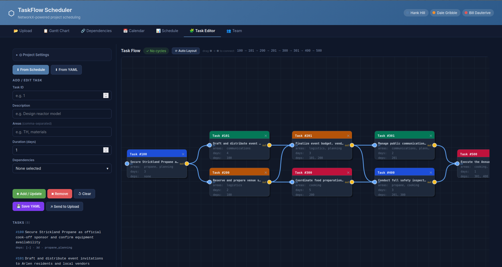
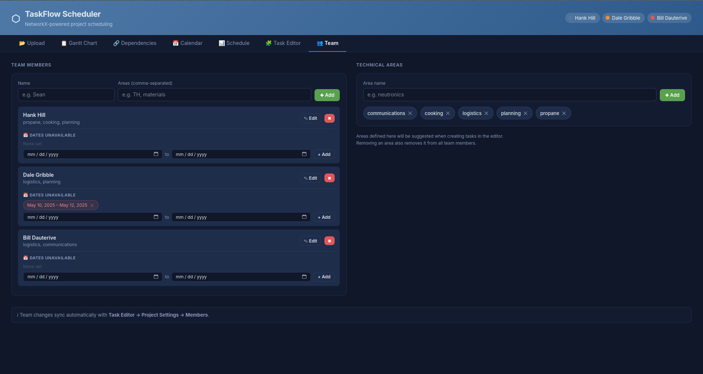

# TaskFlow – Project Scheduler

A dependency-aware project scheduling tool that uses **NetworkX topological sorting** to order tasks, assign them to team members based on skill areas and availability, and produce **Gantt charts** exportable to Excel, CSV, or ICS calendar format.

---

## Quick Start

```bash
pip install -r requirements.txt
python main.py
```

The browser GUI opens automatically at **http://127.0.0.1:5000**.

### CLI Mode (no browser)

```bash
python main.py input.yaml                  # Export to Excel
python main.py input.yaml --fmt csv        # Export to CSV
python main.py input.yaml --fmt ics        # Export to ICS calendar
python main.py input.yaml -o schedule.xlsx # Custom output path
python main.py --port 8080                 # Custom port
python main.py --debug                     # Flask debug mode
```

---

## GUI Walkthrough

### Upload Tab

<!--  -->


This is the starting screen. You have two options:

**Option A — Use a sample file**

Click the sample link at the bottom of the page:
- `king_of_the_hill.yaml` — a multi-task example

**Option B — Upload your own YAML file**

1. Drag and drop a `.yaml` or `.yml` file onto the dashed upload zone, or click the zone to browse for a file.
2. The filename appears as a badge below the zone. Click **✕** to clear it and choose a different file.
3. Click **▶ Run Scheduler** to process the file.

After the scheduler runs, the other tabs populate with results and you are taken to the Gantt Chart tab automatically.

---

### Gantt Chart Tab




Displays a color-coded horizontal Gantt chart of the full schedule.

- Each row is one task. The colored bar spans the task's start and end dates.
- Colors correspond to the assigned team member (the legend is in the top banner).
- A red vertical line marks today's date.
- Hover over a row to highlight it.
- Scroll horizontally to see the full project timeline.

---

### Dependencies Tab



Shows the directed acyclic graph (DAG) of task dependencies.

- The **topological order** is displayed at the top as a chip chain — this is the order tasks must be completed in to respect all dependencies.
- Each node lists the task's predecessors (tasks it depends on) and successors (tasks that depend on it).
- If a circular dependency is detected in your YAML, an error is shown here instead of a schedule.

---

### Calendar Tab



Provides calendar integration for the schedule.

- **Share to Calendar** — opens a modal with options to add individual tasks directly to Google Calendar or Outlook via web links, with a configurable reminder (default 30 minutes before).
- **Quick .ics** — downloads a single `.ics` file containing all tasks that you can import into any calendar app (Apple Calendar, Google Calendar, Outlook, Thunderbird, etc.).
- Each task card also has individual **Google** and **Outlook** buttons to add just that task.

---

### Schedule Tab




A sortable table showing every task with:

| Column | Description |
|--------|-------------|
| ID | Task identifier |
| Description | Task name |
| Areas | Skill areas required |
| Assigned To | Team member assigned |
| Start | Scheduled start date |
| End | Scheduled end date |
| Days | Estimated working days |

Use the **⬇ Excel** and **⬇ CSV** buttons (top-right of the tab) to download the schedule.

---

### Task Editor Tab



A built-in editor for creating and modifying tasks without editing YAML by hand.

**Left panel — Task form and list**

1. Expand **⚙ Project Settings** to set:
   - Project start and end dates
   - Maximum concurrent tasks per person
   - Team members and their skill areas (one per line, format: `Name: area1, area2`)

2. Use the load buttons to pre-populate the editor:
   - **⬇ From Schedule** — loads tasks from the last scheduler run
   - **⬇ From YAML** — loads tasks from the last uploaded YAML file

3. Fill in the task form fields (ID, description, areas, dependencies, estimated days) and click **Add Task** or **Update Task**.

4. Click any task in the task list on the left to select and edit it.

**Right panel — Dependency graph preview**

A live canvas preview of the dependency graph updates as you add or edit tasks. A status badge shows whether the graph is valid (no cycles) or has a problem.

**Running the editor output**

Once your tasks look correct, click **▶ Run Scheduler** within the editor to generate the schedule from your edited task list. The results populate all other tabs.

---

### Team Tab



Manage team members and skill areas independently of a YAML file.

**Team Members**

- Enter a name and a comma-separated list of skill areas, then click **✚ Add**.
- Each member card shows their assigned areas as chips and their unavailability windows.
- To add unavailability (e.g. vacation, leave): use the date pickers on the member card and click **✚ Add** next to the date range.
- Click **✕** on a chip to remove an area from a member.
- Click the trash icon to remove a member entirely.

**Technical Areas**

- Type an area name and click **✚ Add** to register a new skill area.
- Defined areas appear as suggestions in the Task Editor.
- Removing an area here removes it from all team members automatically.

> Changes in the Team tab sync automatically with **Task Editor → Project Settings → Members**.

---

## YAML Input Format

```yaml
start_date: "01/01/2025"
end_date: "12/31/2025"
maximum_tasks: 2          # max concurrent tasks per person

members:
  - name: "Sean"
    areas: ["TH", "materials"]
    dates_unavailable:
      - ["12/24/2025", "12/26/2025"]   # [start, end] inclusive

  - name: "Dylan"
    areas: ["neutronics", "multiphysics"]
    dates_unavailable: []

tasks:
  - ID: 1
    description: "Identify hot spots"
    areas: ["TH"]
    dependencies: [2, 3]       # task IDs this task depends on
    estimated_time_days: 7

  - ID: 2
    description: "Select cladding material"
    areas: ["materials"]
    dependencies: []
    estimated_time_days: 10
```

**Key rules:**
- `areas` on a task must overlap with at least one member's `areas` for assignment to work.
- `dependencies` lists task IDs that must complete before this task can start.
- Circular dependencies are detected and reported as an error.
- `dates_unavailable` ranges are inclusive and skip weekends automatically.
- Scheduling is Monday–Friday only (weekends are skipped).

---

## Project Structure

```
taskflow/
├── main.py                       # Entry point (web GUI + CLI)
├── webapp.py                     # Flask web application
├── scheduler.py                  # Core engine (NetworkX, scheduling, exports)
├── templates/
│   └── index.html                # Web GUI (single-page app)
├── static/
│   └── king_of_the_hill.yaml     # Multi-task example
├── requirements.txt
└── README.md
```

---

## Dependencies

| Package | Purpose |
|---------|---------|
| `flask` | Web GUI server |
| `networkx` | Dependency graph & topological sort |
| `pyyaml` | YAML input parsing |
| `openpyxl` | Excel Gantt chart export |

---

## License

MIT

---

## Attribution

Much of the code in this project was generated with the assistance of [Claude Code](https://claude.ai/code), Anthropic's AI-powered coding tool.
